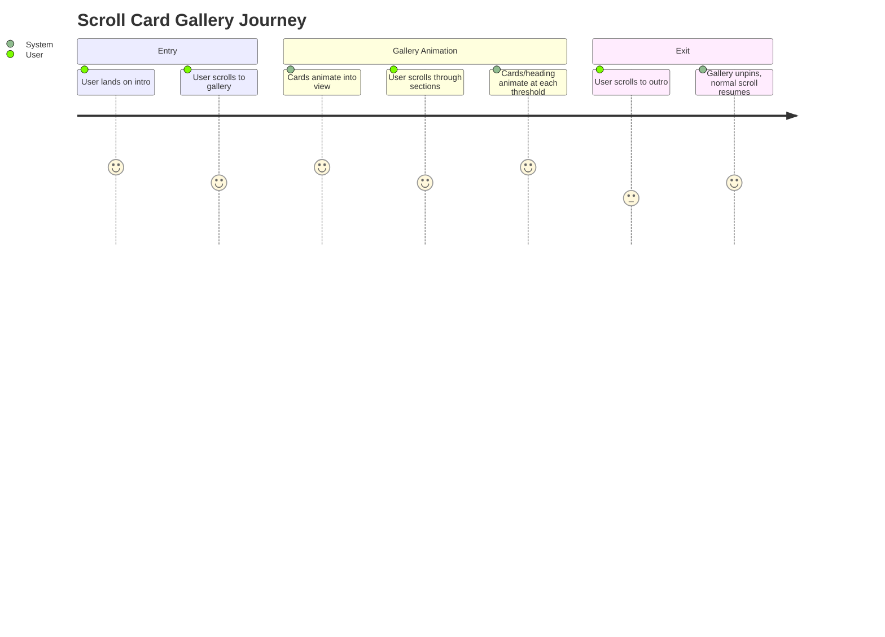

# PolyApp Scroll Animation Documentation

This documentation explains the structure, purpose, and logic behind the **PolyApp Scroll Animation** project. The project is a visually rich, scroll-driven card gallery that smoothly animates transitions between multiple sections using GSAP, ScrollTrigger, and Lenis for smooth scrolling.


## index.html

This file serves as the entry point of the application. It structures the content, loads the required stylesheets and scripts, and defines the sections that the animation will interact with.

### Overview

- **HTML5 document** with semantic structure.
- Loads custom **styles** and **external scripts**.
- Provides three visually distinct sections: **intro**, **gallery**, and **outro**.

### Key Elements

| Element               | Description                                                                                   |
|-----------------------|-----------------------------------------------------------------------------------------------|
| `<section class="intro">`   | The opening section, displays the initial heading.                                      |
| `<section class="gallery">` | The animated card gallery is rendered here, along with a heading that changes per section. |
| `<section class="outro">`   | The closing section, contains a final heading.                                          |

### External Libraries Included

- **GSAP** (`gsap.min.js`): For high-performance animations.
- **GSAP ScrollTrigger**: Links scroll position to animations.
- **Lenis**: Smooth scrolling polyfill for modern UX.

### Script Loading Order

> GSAP and ScrollTrigger **must** load before `script.js`, and Lenis must be loaded before the script runs.

### HTML Code Structure

```html
<!DOCTYPE html>
<html lang="en">
<head>
  <meta charset="UTF-8">
  <meta name="viewport" content="width=device-width, initial-scale=1.0">
  <title>PolyApp Scroll Animation | thakuma.dev</title>
  <link rel="stylesheet" href="./styles.css">
</head>
<body>
  <section class="intro">
    <h1>Time loosens its grip and the stack begins to shift</h1>
  </section>
  <section class="gallery">
    <h1></h1>
  </section>
  <section class="outro">
    <h1>Eventually, the stack settles and the scroll continues</h1>
  </section>
  <!-- GSAP -->
  <script src="https://cdn.jsdelivr.net/npm/gsap@3.12.5/dist/gsap.min.js"></script>
  <!-- ScrollTrigger -->
  <script src="https://cdn.jsdelivr.net/npm/gsap@3.12.5/dist/ScrollTrigger.min.js"></script>
  <!-- Lenis -->
  <script src="https://unpkg.com/@studio-freight/lenis@1.0.42/dist/lenis.min.js"></script>
  <!-- Your Script -->
  <script src="./script.js"></script>
</body>
</html>
```

---

## styles.css

This file defines the visual style, responsive behavior, and layout for the application. It leverages custom properties for color theme and a custom font for a distinctive look.

### Key Features

- **Custom Font:** Uses "Instrument Serif" for a refined, literary appearance.
- **CSS Variables:** Theme colors for easy customization.
- **Fluid Typography:** Headings adapt to viewport size.
- **Flex Centering:** Perfectly centers content in each section.
- **Card Styling:** 
  - Cards are absolutely positioned, sized, and bordered.
  - Images within cards are scaled and cropped aesthetically.
- **Responsive Design:** Headings adapt to small screens.

### CSS Highlights

```css
@font-face {
  font-family: "Instrument Serif";
  src: url(./fonts/InstrumentSerif-Regular.ttf);
}

:root {
  --base-100: #fff;
  --base-200: #4a4a4a;
  --base-300: #141414;
  --base-400: #0f0f0f;
}

body {
  font-family: "Instrument Serif", sans-serif;
}

h1 {
  font-size: clamp(3rem, 5vw, 7vw);
  font-weight: 500;
  line-height: 0.9;
  letter-spacing: -0.025rem;
}

section {
  position: relative;
  width: 100%;
  height: 100svh;
  display: flex;
  justify-content: center;
  align-items: center;
  color: var(--base-100);
  overflow: hidden;
}

.card {
  position: absolute;
  width: 250px;
  height: 300px;
  border-radius: 1rem;
  border: 0.5rem solid var(--base-200);
  box-sizing: 5px 5px 10px rgba(0, 0, 0, 0.25);
  will-change: transform;
  overflow: hidden;
}

.card img {
  width: 100%;
  height: 100%;
  object-fit: cover;
  border-radius: 0.5rem;
}
```

#### Visual Structure

- **Intro & Outro:** Dark background, white text for high contrast.
- **Gallery:** Slightly lighter dark for card contrast.
- **Cards:** Soft borders, subtle shadow, rounded corners.

---

## script.js

This file is the **core logic** of the interactive scroll animation. It manages the card gallery, heading transitions, section changes, and the smooth scroll experience.

### Core Responsibilities

- Initializes **Lenis** smooth scrolling and links GSAP's ticker for perfectly synced scroll/animation.
- Defines configuration for **card count, size, animation timing, and headings**.
- Dynamically **generates card elements** with random positions and rotations.
- Animates cards **out and in** when the user scrolls past predefined thresholds.
- Updates the gallery heading with elegant fade transitions.
- Handles **responsive layout** when the window is resized.

---

### Functional Breakdown

#### 1. Initialization & Safety Checks

- Ensures **Lenis** is loaded before proceeding.
- Registers ScrollTrigger with GSAP.
- Sets up the initial gallery state and heading.

```js
if (typeof Lenis === "undefined") {
  console.error("Lenis is not loaded. Check CDN order in index.html");
  return;
}
const lenis = new Lenis();
lenis.on("scroll", ScrollTrigger.update);
gsap.ticker.add((time) => lenis.raf(time * 1000));
gsap.ticker.lagSmoothing(0);
```

#### 2. Configuration

- **Number of cards**, card dimensions, animation durations, and heading texts are all centrally configured.

```js
const CONFIG = {
  cardCount: 15,
  cardWidth: 250,
  cardHeight: 300,
  animationDuration: 0.75,
  animationOverlap: 0.5,
  headingFadeDuration: 0.5,
  headings: [
    "Order its temporary while you're passing through",
    "memories shuffle like cards in an endless deck",
    "Each moment scatters as another takes its place",
    "The fragments float before settings once more",
  ],
};
```

#### 3. Gallery and State Variables

- **Viewport**: Tracks center, min/max card radius for placement.
- **State**: Which cards are active, current section, animation lock.

#### 4. Card Creation

- **createCards(setNumber)**
  - Creates 15 cards per section, each with unique image (`assets/setX/imgY.jpg`).
  - Randomizes angular position, distance from center, and rotation.
  - Appends cards to the `.gallery` DOM element.

#### 5. Animating Cards and Headings

- **animateHeading(newText)**
  - Fades out current heading, swaps the text, fades in.
- **animateCards(exitingCards, enteringCards)**
  - Animates old cards to the screen edge (off-canvas).
  - Animates new cards from the edge into position.

#### 6. Section Transitions

- **ScrollTrigger** monitors scroll progress.
  - When progress crosses section boundaries (`0.25`, `0.5`, `0.75`), triggers transitions.
  - Ensures only one animation runs at a time (`state.isAnimating`).

#### 7. Responsiveness

- **updateViewport()** and event listener on window resize.
- Adjusts center and card radius range.
- Recreates card layout on resize.

---

### Card Animation Flow

Here is a diagram showing how the card animations respond to scroll events:

```mermaid
flowchart TD
    Start[ScrollTrigger onUpdate] --> CheckAnim[Is animating?]
    CheckAnim -- Yes --> EndAnim[Do nothing]
    CheckAnim -- No --> GetSection[Get section index from progress]
    GetSection -- Same as current --> EndSection[Do nothing]
    GetSection -- Different section --> AnimateOut[animateCards (old out, new in)]
    AnimateOut --> AnimateHeading[animateHeading (fade old text, set new, fade in)]
    AnimateHeading --> UpdateState[Update state to new cards/section]
    UpdateState --> ReleaseLock[Set isAnimating false]
```

---

### Scroll-Driven Gallery State

- The gallery is **"pinned"** for the duration of the scroll, so it stays visible as you scroll.
- As you scroll, **the section index is calculated** from progress.
    - **0–25%:** Section 1
    - **25–50%:** Section 2
    - **50–75%:** Section 3
    - **75–100%:** Section 4

When you pass each threshold, the gallery heading and all the cards animate smoothly to the next state.

---

### Key Functions Detailed

#### createCards

Creates and positions cards in a circular, randomized layout.

```js
function createCards(setNumber) {
  const cards = [];
  for (let i = 0; i < CONFIG.cardCount; i++) {
    const card = document.createElement("div");
    card.classList.add("card");
    const img = document.createElement("img");
    img.src = `assets/set${setNumber}/img${i + 1}.jpg`;
    card.appendChild(img);
    const angle = Math.random() * Math.PI * 2;
    const radius = viewport.rangeMin + Math.random() * (viewport.rangeMax - viewport.rangeMin);
    const centerX = viewport.centerX + Math.cos(angle) * radius;
    const centerY = viewport.centerY + Math.sin(angle) * radius;
    gsap.set(card, {
      left: centerX - CONFIG.cardWidth / 2,
      top: centerY - CONFIG.cardHeight / 2,
      rotation: Math.random() * 50 - 25,
    });
    gallery.appendChild(card);
    cards.push({ element: card, centerX, centerY });
  }
  return cards;
}
```

#### animateCards

Handles animating cards **out** (old section) and **in** (new section) with spatial logic for edge positions.

```js
function animateCards(exitingCards, enteringCards) {
  const tl = gsap.timeline();
  exitingCards.forEach(({ element, centerX, centerY }) => {
    const targetEdge = getEdgePosition(centerX, centerY);
    tl.to(element, {
      left: targetEdge.x,
      top: targetEdge.y,
      rotation: Math.random() * 180 - 90,
      duration: CONFIG.animationDuration,
      ease: "power2.in",
      onComplete: () => element.remove(),
    }, 0);
  });
  enteringCards.forEach(({ element, centerX, centerY }) => {
    const targetEdge = getEdgePosition(centerX, centerY);
    gsap.set(element, {
      left: targetEdge.x,
      top: targetEdge.y,
      rotation: Math.random() * 180 - 90,
    });
    tl.to(element, {
      left: centerX - CONFIG.cardWidth / 2,
      top: centerY - CONFIG.cardHeight / 2,
      rotation: Math.random() * 50 - 25,
      duration: CONFIG.animationDuration,
      ease: "power2.out",
    }, CONFIG.animationOverlap);
  });
  return tl;
}
```

---

### Gallery State Transitions

Transitions are orchestrated with GSAP timelines and ScrollTrigger's update callback. The gallery remains **interactive and responsive** throughout window size changes.

---

## User Experience Flow



---

## Important Notes

```card
{
  "title": "Image Assets Required",
  "content": "You must provide images at ./assets/setX/imgY.jpg for all X (1-4) and Y (1-15) to avoid broken image links."
}
```

```card
{
  "title": "Lenis Library Order",
  "content": "Lenis must be loaded before script.js. If you see the error 'Lenis is not loaded', check your CDN order."
}
```

---

## Summary Table

| File         | Purpose                                 | Technologies              | Key Features                     |
|--------------|-----------------------------------------|---------------------------|----------------------------------|
| index.html   | Page structure & resource loading       | HTML, GSAP, Lenis         | 3 sections, script/CDN ordering  |
| styles.css   | Theming & responsive card gallery style | CSS, custom font, vars    | Flex layout, card visuals        |
| script.js    | Card animation & scroll interaction     | JS, GSAP, Lenis, DOM API  | Scroll-driven transitions        |

---

## No API Endpoints

This project is **purely frontend** with no HTTP API endpoints, routes, or controllers. **No API documentation blocks are required**.

---

## Final Thoughts

This codebase demonstrates a modern, smooth, and responsive scroll-driven animation experience. It is a strong example of creative front-end engineering using GSAP and modern scroll libraries, with a focus on **fluid motion, dynamic layouts, and poetic transitions**. The modular configuration and separation of concerns make it easy to extend with new sections, assets, or card behaviors in the future.
